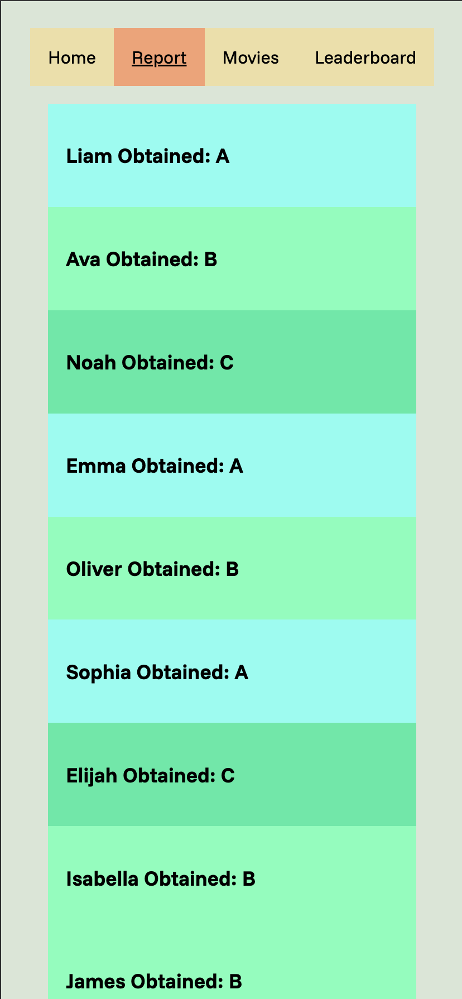
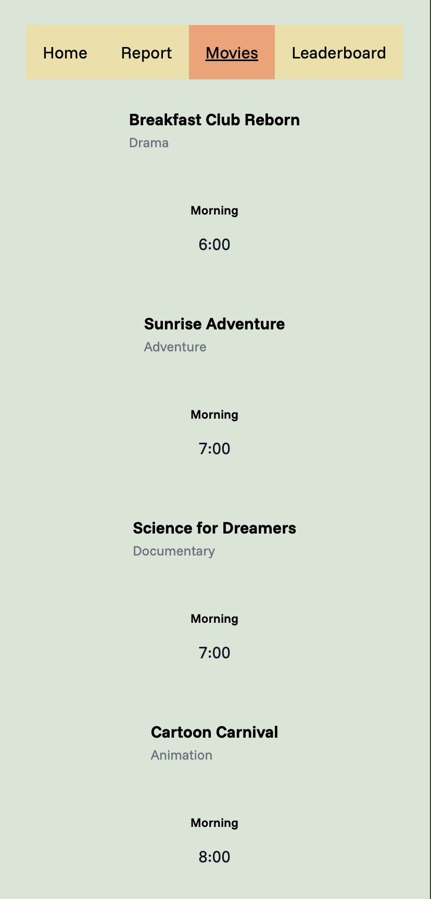
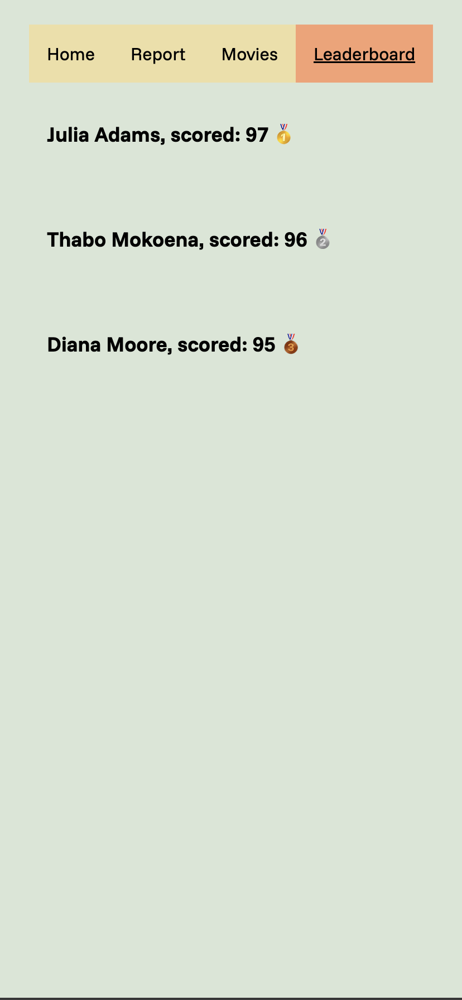

# List-rendering

I created this new repo so that my mentors can review the PR and leave comments.

## How to run this?

1. Install Bun

```bash
curl -fsSL https://bun.sh/install | bash
```

2. Run

```bash
bun install
```

3. Run

```bash
bun run dev
```

## What does it look like?

Did all 3 tasks, did not implement any state or persistence. Any sorting and filtering happens inside parent component and is not changeable at this time, i.e. cannot filter students for those with A's or B's.

## Screenshots

### Students



### Movies



### Leaderboard


